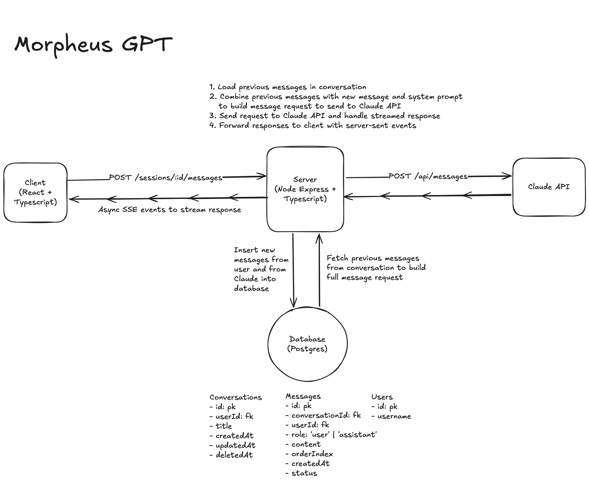
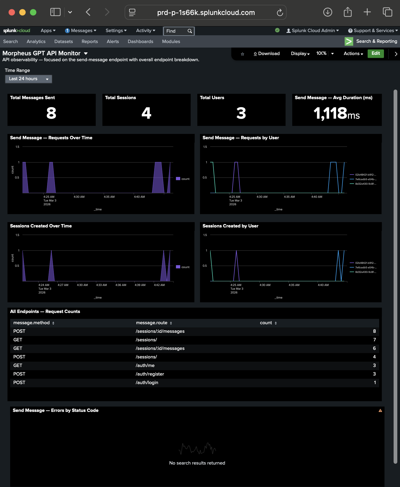

# MorpheusGPT

A Matrix-themed ChatGPT clone — chat with Morpheus via streaming token-by-token responses. Session management, auth, mobile-friendly.

**Live demo**: [morpheus-gpt.com](https://morpheus-gpt.com)

## Architecture



- **Frontend**: React 19 + TypeScript (Vite), Tailwind CSS, react-markdown
- **Backend**: Express + TypeScript, Prisma ORM, Zod validation
- **Database**: SQLite (dev) / PostgreSQL (prod via Railway)
- **LLM**: Claude API (Haiku for chat + title generation)
- **Auth**: bcrypt password hashing + JWT (7-day expiry)

### Streaming

`POST /sessions/:id/messages` uses **Server-Sent Events (SSE)**: client sends a message, server streams Claude's response token-by-token as SSE events. On cancel, client aborts the fetch and server calls `stream.abort()` on the Anthropic SDK to stop generation and save partial content. SSE chosen over WebSockets for simplicity — unidirectional streaming is all we need.

### Data Model

```
User (id, username, passwordHash, createdAt)
  └── Session (id, title?, userId, createdAt, updatedAt, deletedAt?)
        └── Message (id, sessionId, role, content, orderIndex, status, idempotencyKey?, createdAt)
```

- **`orderIndex`**: deterministic message ordering independent of timestamps
- **`status`**: tracks streaming lifecycle (`streaming` → `complete` | `cancelled` | `error`)
- **`deletedAt`**: soft deletes preserve data for recovery
- **`idempotencyKey`**: unique constraint on `(sessionId, idempotencyKey)` prevents duplicate submissions
- **`userId` on Session**: full session isolation per user

## Failure & Edge Cases Handled

- **LLM failure mid-stream**: partial content saved as `error`, error event sent to client
- **User refresh during streaming**: stale `streaming` messages detected on reload and marked `error`
- **Client disconnect/cancel**: server aborts Anthropic stream immediately (saves API credits), partial content saved as `cancelled`
- **Duplicate submission**: idempotency key on messages + 1-second client-side dedup
- **Long conversations**: context truncation drops oldest messages to stay within ~80k token window

## Production Considerations

- **Bottlenecks**: Claude API latency (~2-10s first token), database writes during streaming
- **Cost drivers**: Claude API usage scales with context window size — truncation helps control costs
- **Security**: bcrypt (10 rounds), JWT auth, API key in env vars only, Prisma ORM prevents SQL injection, React escaping mitigates XSS, session isolation per user
- **Observability**: structured logging via Splunk HEC — every API request emits a canonical log line (method, route, status, duration, userId) to a Splunk index. A [dashboard](server/splunk-dashboard.json) tracks message/session volume, per-user activity, error rates, and endpoint breakdown.



### Testing
- **Backend API** (Vitest + Supertest): session CRUD, auth enforcement, and input validation against a real SQLite database
- **Frontend components** (Vitest + React Testing Library): input behavior, streaming UI states, and keyboard interactions
- **End-to-end** (Playwright): full user flow — registration, multi-turn chat with streamed responses, and session management — against a live server

## Time Allocation

- Architecture & planning: ~30 min
- Backend (API, DB, streaming): ~2 hours
- Frontend (UI, state, SSE client): ~2 hours
- Authentication (JWT, auth pages): ~1 hour
- Mobile polish & bug fixes: ~30 min
- Tests & documentation: ~30 min

## Local Setup

Requires Node.js 20+ and an [Anthropic API key](https://console.anthropic.com/).

```bash
git clone <repo-url> && cd morpheus-gpt

# Backend
cp .env.example server/.env   # add ANTHROPIC_API_KEY and JWT_SECRET
cd server && npm install && npm run db:push && npm run dev

# Frontend (separate terminal)
cd client && npm install && npm run dev
```

Frontend: `http://localhost:5173` | Backend: `http://localhost:3001`

## Tests

```bash
cd server && npm test          # backend unit tests
cd client && npm test          # frontend unit tests
cd client && npm run test:e2e  # Playwright e2e
```
